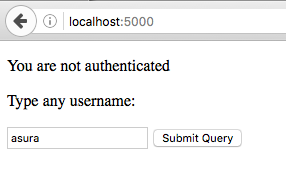
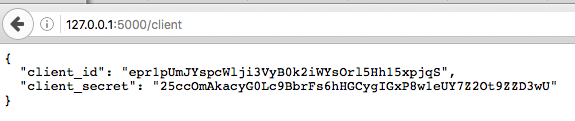
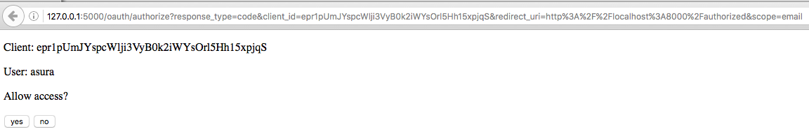
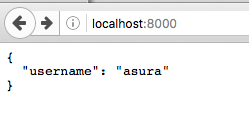

# Example for OAuth 2 Server

This is an example of OAuth 2 Server.

Find more details on <http://lepture.com/en/2013/create-oauth-server>

# Installation

    $ pip install -r requirements.txt

# Usage

1. Start your provider server with:

        $ python app.py

2. Visit [http://127.0.0.1:5000/](http://127.0.0.1:5000/) and fill a username.

    

3. And then visit [http://127.0.0.1:5000/client](http://127.0.0.1:5000/client)

    

4. Take the client key and client secret, and modify our [client.py](client.py)
script with the key and secret.
Specifically update `CLIENT_ID` and `CLIENT_SECRET` variables on lines 5-6.

5. Start the client server with:

        $ python client.py

6. Visit [http://localhost:8000](http://localhost:8000), everything should work
correctly. We will be redirected to a confirm page, if we choose yes, client
will obtain a pair of access token and secret.

    
    

7. Finally, if you visit [http://localhost:8000](http://localhost:8000)
you can access the authorized data:

    
