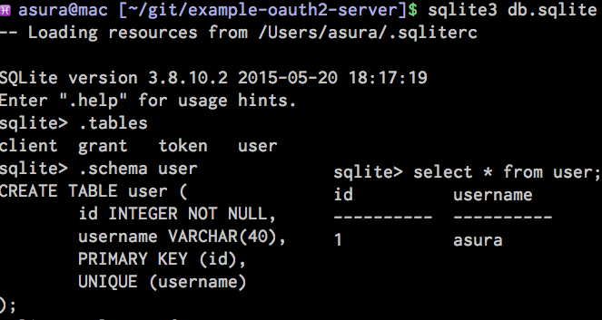

# Example for OAuth 2 Server

This is an example of OAuth 2 Server.

Find more details on <http://lepture.com/en/2013/create-oauth-server>

# OAuth 2.0

The OAuth 2.0 Authorization Framework is described by
[rfc6749](https://tools.ietf.org/html/rfc6749)

     +--------+                               +---------------+
     |        |--(A)- Authorization Request ->|   Resource    |
     |        |                               |     Owner     |
     |        |<-(B)-- Authorization Grant ---|               |
     |        |                               +---------------+
     |        |
     |        |                               +---------------+
     |        |--(C)-- Authorization Grant -->| Authorization |
     | Client |                               |     Server    |
     |        |<-(D)----- Access Token -------|               |
     |        |                               +---------------+
     |        |
     |        |                               +---------------+
     |        |--(E)----- Access Token ------>|    Resource   |
     |        |                               |     Server    |
     |        |<-(F)--- Protected Resource ---|               |
     +--------+                               +---------------+

# Installation

    $ pip install -r requirements.txt

# Usage

1. Start your provider server with:

        $ python app.py

2. Visit [http://127.0.0.1:5000/](http://127.0.0.1:5000/) and fill a username.

    

    At the database level this translates into adding a row to the **user** table:

    

3. And then visit [http://127.0.0.1:5000/client](http://127.0.0.1:5000/client)

    

    At the database level this translates into adding a row to the **client** table:

    

4. Take the client key and client secret, and modify our [client.py](client.py)
script with the key and secret.
Specifically update `CLIENT_ID` and `CLIENT_SECRET` variables on lines 5-6.
These two strings are used to initialize the `oauth.remote_app` object
used by the client code.

5. Start the client server with:

        $ python client.py

6. Visit [http://localhost:8000](http://localhost:8000).
This page will redirect us to the server to authorize the client and when we click "yes" we are redirected back to the client which now has
a pair of access token and secret.

    
    

    At the database level this translates into adding a row to the **token** table:

    

7. Finally, if you visit [http://localhost:8000](http://localhost:8000)
you can access the authorized data:

    
